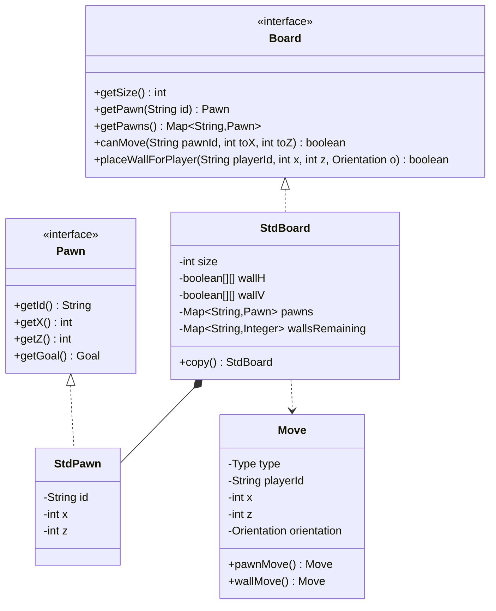

# Rapport Technique : Moteur de Jeu Quoridor et Intelligence Artificielle
*Projet de Master 1 — Conception Logicielle et Algorithmique de Recherche*

---

## Table des Matières
1. [Introduction](#1-introduction)
2. [Manuel d’Utilisation](#2-manuel-dutilisation)
3. [Détail des Structures de Données](#3-détail-des-structures-de-données)
4. [Principales Fonctions du Programme](#4-principales-fonctions-du-programme)
5. [Descriptif des Fonctions d’Évaluation Choisies](#5-descriptif-des-fonctions-dévaluation-choisies)
6. [Étude de la Stratégie du Jeu](#6-étude-de-la-stratégie-du-jeu)
7. [Conclusion](#7-conclusion)

---

## 1. Introduction
Ce projet présente le développement d'un moteur de jeu complet pour **Quoridor**, doté d'une interface graphique JavaFX en 3D et de plusieurs algorithmes d'Intelligence Artificielle.

L'architecture sépare distinctement le modèle de données (plateau, barrières et pions), la vue en trois dimensions et le module de recherche IA. Ce rapport technique décrit les choix de conception, les structures de données principales, ainsi que les stratégies de recherche utilisées pour optimiser les calculs des agents autonomes.

---

## 2. Manuel d’Utilisation

### 2.1. Compilation et Lancement
Le projet est structuré avec **Maven** pour la gestion du cycle de vie et des dépendances.

* **Prérequis :** JDK 25 `sudo apt install openjdk-25-jdk` et Maven installé `sudo apt install maven`.
* **Compilation classique :**
  ```bash
  mvn clean compile
  ```
* **Lancement en mode développement (depuis les sources) :**
  ```bash
  mvn javafx:run
  ```
* **Génération de l'exécutable autonome (Fat JAR) :**
  ```bash
  mvn clean package
  ```
* **Lancement du Fat JAR autonome :**
  ```bash
  java -jar target/quoridor-1.0-SNAPSHOT.jar
  ```
* **Exécution des tests unitaires :**
  ```bash
  mvn test
  ```

### 2.2. Interface et Navigation
Au démarrage, le menu géré par `MenuController` permet les actions suivantes :
1. **Nouvelle Partie :** Initialise et affiche le plateau de jeu.
2. **Difficulté :** Ajuste la profondeur de recherche de l'IA (Facile = 1, Moyen = 2, Difficile = 3).
3. **Règles :** Affiche une notice décrivant le but et les contraintes de pose et de mouvement.
4. **Replays :** Charge un historique de coups au format JSON via le module `replay` pour une lecture pas à pas.

### 2.3. Interactions en Jeu
* **Déplacements :** Le pion actif se déplace par un clic sur l'une des cases adjacentes mises en surbrillance.
* **Pose de Barrière :** Le joueur appuie sur soit la touche CTRL, soit la touche MAJ et maintient la pression sur la touche, en passant la souris sur les cases, il obtient une prévisualisation de la pose de la barrière. Le moteur valide le coup en s'assurant qu'il reste au moins un chemin d'accès vers la ligne d'arrivée pour chaque joueur.
* **Caméra 3D :** La scène permet une rotation et un zoom pour observer le plateau sous différents angles.

---

## 3. Détail des Structures de Données

Le modèle repose sur des classes légères, conçues pour être copiées rapidement lors de la phase de recherche dans l'arbre de jeu.



### 3.1. Le Plateau : `Board` et `StdBoard`
La classe `StdBoard` stocke l'état du jeu sous forme matricielle :
* **`wallH` (`boolean[][]` de taille $N \times (N-1)$) :** Enregistre la présence de barrières horizontales.
* **`wallV` (`boolean[][]` de taille $(N-1) \times N$) :** Enregistre la présence de barrières verticales.
* **`pawns` (`Map<String, Pawn>`) :** Associe chaque joueur à son pion (`StdPawn`) contenant sa position $(x, z)$.
* **`wallsRemaining` (`Map<String, Integer>`) :** Gère le nombre de barrières disponibles pour chaque joueur (initialement 10).

### 3.2. Représentation des Actions : `Move`
La classe `Move` représente une action atomique :
* `Type type` : `PAWN` (déplacement) ou `WALL` (pose de barrière).
* `String playerId` : Identifiant du joueur.
* `int x, z` : Destination du pion ou ancrage de la barrière.
* `Orientation orientation` : Orientation de la barrière (`HORIZONTAL` ou `VERTICAL`).

### 3.3. Hachage : `ZobristHasher`
Afin d'éviter la réévaluation de positions identiques atteintes par des chemins différents, un hachage de Zobrist produit une empreinte de 64 bits (type `long`) de l'état actuel :
* Table `pawnTable` pour la position de chaque pion.
* Tables `wallHTable` et `wallVTable` pour l'emplacement des barrières.
* Un tableau `turnTable` pour identifier le joueur actif.
L'empreinte se met à jour par des opérations de type OU Exclusif (XOR), rapides à calculer.

### 3.4. Cache de Recherche : `TranspositionTable`
Cette table stocke les évaluations des états déjà explorés. Chaque entrée (`Entry`) mémorise :
* La profondeur restante lors du stockage.
* Le score calculé.
* Le type de borne (`Bound` : `EXACT`, `LOWER` ou `UPPER`).
* Le meilleur coup associé pour guider l'ordonnancement futur.

---

## 4. Principales Fonctions du Programme

### 4.1. Pathfinding (BFS)
La classe `Pathfinding` implémente un parcours en largeur d'abord (BFS) pour calculer le plus court chemin entre un pion et sa ligne d'arrivée :

```
Algorithme BFS de Distance Minimale
Entrées : board (Plateau), pawn (Pion)
Sorties : distance (int, ou INFINI si aucun chemin)

Déclarer Visited[taille][taille] initialisé à faux
Déclarer File (Queue) d'éléments [x, z, dist]

Ajouter [pawn.getX(), pawn.getZ(), 0] à la File
Marquer Visited[pawn.getX()][pawn.getZ()] à vrai

Tant que la File n'est pas vide :
    Dépiler [cx, cz, dist]
    Si le but est atteint en (cx, cz) :
        Retourner dist
    
    Pour chaque voisin (nx, nz) de (cx, cz) :
        Si (nx, nz) est valide ET non visité ET sans mur bloquant :
            Marquer Visited[nx][nz] à vrai
            Enfiler [nx, nz, dist + 1]

Retourner INFINI
```

Le BFS sert également à valider la pose de barrières en garantissant qu'aucun joueur n'est complètement enfermé.

### 4.2. Générateur de Coups : `MoveGenerator`
Cette fonction liste l'ensemble des coups légaux pour le joueur actif :
* **Mouvements :** Déplacements simples sur les cases libres ou sauts par-dessus l'adversaire (y compris en diagonale si un mur bloque le saut direct).
* **Barrières :** Analyse de tous les emplacements libres possibles, puis filtrage des configurations provoquant un blocage total via le pathfinding.

### 4.3. Moteurs de Recherche
Le projet compare plusieurs techniques de recherche :
* **Minimax :** Exploration complète de l'arbre jusqu'à la limite fixée.
* **Alpha-Beta / Nega-Alpha-Beta :** Élagage des branches inutiles en suivant les bornes $\alpha$ et $\beta$, réduisant le nombre de nœuds visités.
* **SSS\* via MTD-f :** Alternative au SSS\* classique. Il procède par recherches Alpha-Beta successives à fenêtres de recherche nulles (type $[\beta-1, \beta]$) pour converger vers la valeur minimax en s'appuyant sur la table de transpositions.

---

## 5. Descriptif des Fonctions d’Évaluation Choisies

### 5.1. Évaluation Statique
La fonction principale calcule le score relatif d'une position :

$$Score = (D_{opp} - D_{me}) \times 10 + (W_{me} - W_{opp}) \times 2$$

Où :
* **$D_{me}$ / $D_{opp}$ :** Distance minimale de chaque joueur vers son but calculée par BFS.
* **$W_{me}$ / $W_{opp}$ :** Barrières restantes en réserve.

#### Choix des coefficients :
* **Distance ($\times 10$) :** Priorité absolue donnée à la progression vers le but.
* **Barrières ($\times 2$) :** Poids modéré incitant l'IA à utiliser une barrière uniquement si celle-ci provoque un allongement significatif du chemin adverse ($>1$ case).
* **Cas terminaux ($\pm 100\ 000$) :** Score extrême attribué immédiatement lorsqu'un joueur atteint son but.

### 5.2. Évaluation Incrémentale
Pour réduire le coût CPU lié aux calculs répétés du BFS, la classe `IncrementalHeuristic` gère un état local :
* Lors d'un simple mouvement de pion, seul le BFS du pion déplacé est recalculé.
* Lors de la pose d'un mur, l'ensemble des BFS est recalculé car les chemins de tous les joueurs peuvent être altérés.

---

## 6. Étude de la Stratégie du Jeu

Le jeu Quoridor repose sur un équilibre entre vitesse et obstruction :
1. **Contrôle des Chemins :** L'objectif est d'allonger la trajectoire de l'adversaire tout en maintenant la sienne minimale.
2. **Gestion de la Réserve de Murs :** Poser un mur trop tôt réduit les options en fin de partie. L'IA préfère temporiser et économiser son stock pour forcer des détours décisifs lors du duel de fin de partie.
3. **Parité lors du Saut :** Lorsque les pions se rencontrent, le franchissement direct donne un avantage de tempo. L'IA cherche à anticiper cette rencontre pour contraindre l'adversaire à utiliser des barrières de déviation.

---

## 7. Conclusion
L'architecture découplée permet une manipulation efficace du moteur de jeu. La combinaison des algorithmes de recherche (Alpha-Beta, Nega-Alpha-Beta, MTD-f) et d'une heuristique basée sur les distances BFS fournit un agent réactif adapté aux limites de temps du jeu en temps réel.
